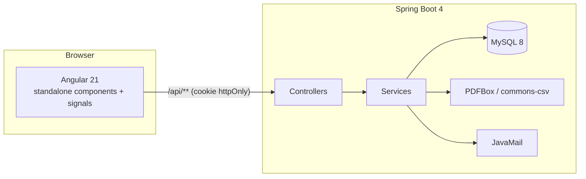
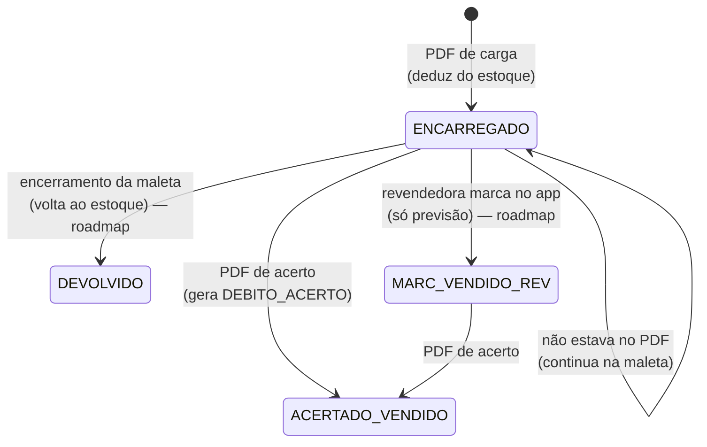
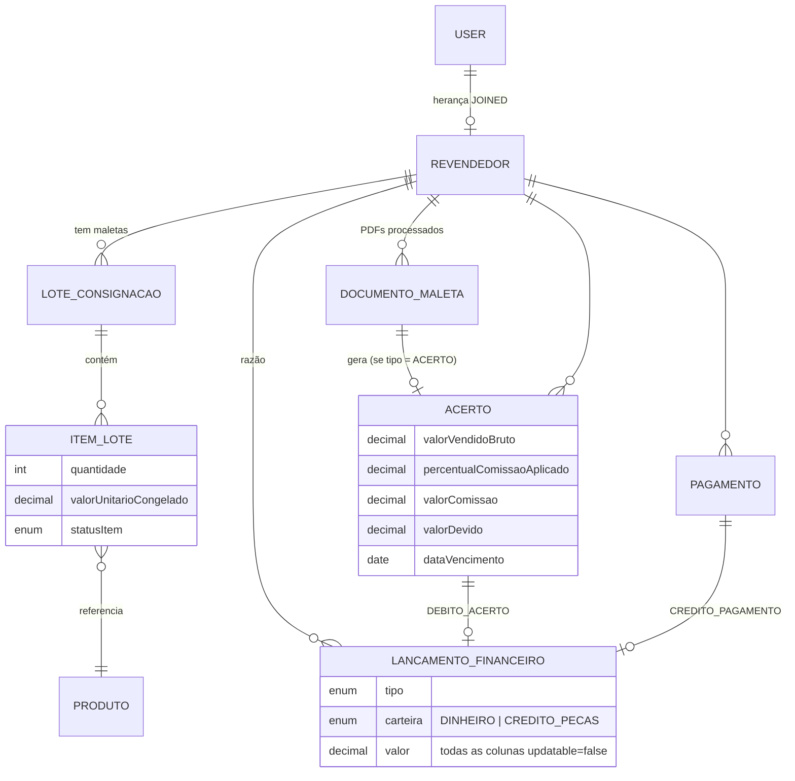

# Menegati Joias — Portal B2B de Revendedoras

> Sistema de gestão de **consignação de semijoias** para uma loja real: a administradora carrega uma
> "maleta" de peças para cada revendedora, acompanha o que foi vendido, gera o acerto financeiro e
> controla a dívida de cada uma — tudo a partir dos PDFs que o sistema legado da loja já emite.
>
> *Full-stack B2B consignment management system for a jewelry store — Spring Boot 4 / Java 25 API
> with an append-only financial ledger, PDF-driven imports, and an Angular 21 front end.*


---

## Sumário

- [O problema](#o-problema)
- [O que o sistema faz](#o-que-o-sistema-faz)
- [Arquitetura](#arquitetura)
- [Decisões de design](#decisões-de-design)
- [Modelo de domínio](#modelo-de-domínio)
- [Stack](#stack)
- [Como rodar](#como-rodar)
- [Testes](#testes)
- [Estrutura do repositório](#estrutura-do-repositório)
- [Estado atual e roadmap](#estado-atual-e-roadmap)

---

## O problema

A Menegati Joias trabalha com **revendedoras em consignação**: cada uma recebe uma maleta com
dezenas de peças, vende durante ~30 dias, e no encontro presencial a loja confere o que saiu.
A revendedora fica com **40%** do valor vendido e deve os **60%** restantes à loja; o que não vendeu
continua na maleta para o próximo ciclo.

Hoje esse controle é feito em papel e em um ERP de balcão que só sabe emitir PDFs. Ninguém sabe,
sem ligar para a dona da loja, **quanto cada revendedora deve, desde quando, e quanto de mercadoria
está na rua**. Este projeto substitui isso por um sistema onde:

- a admin **sobe os PDFs que o ERP já gera** e o sistema faz o resto (sem redigitar nada);
- cada revendedora tem um painel com **sua maleta atual e seu histórico**;
- toda dívida é **rastreável até o lançamento que a originou**.

É um projeto solo, construído para uso real, com a regra de negócio levantada diretamente com a dona
da loja.

---

## O que o sistema faz

### Painel da admin (`ROLE_ADMIN`)

| Funcionalidade | Endpoint | Como funciona |
|---|---|---|
| Importar estoque | `POST /api/admin/estoque/importar` | CSV do ERP → tabela `produto`. Linhas inválidas são puladas e reportadas, não abortam o import. |
| Carregar maleta | `POST /api/admin/lote/importar` | PDF de carga → extrai CPF, nº da consignação e a lista de peças por regex; cria/atualiza o `LoteConsignacao` aberto da revendedora e **deduz do estoque global**. |
| Acertar maleta | `POST /api/admin/lote/acertar` | PDF de acerto → marca as peças listadas como vendidas (com **venda parcial**: se carregou 3 e vendeu 2, o item é dividido), gera o `Acerto` e o débito no razão financeiro. |
| Registrar pagamento | `POST /api/admin/revendedora/{id}/pagamentos` | Cria um `Pagamento` e o crédito correspondente. Pagamento parcial funciona por construção. |
| Saldo / extrato | `GET /api/admin/revendedora/{id}/saldo` · `/extrato` | Somatório e listagem dos lançamentos da carteira `DINHEIRO`. |
| Dashboard | `GET /api/admin` | Lista de revendedoras com **saldo devedor, exposição de maleta e data do último acerto**, estoque e feed dos últimos processamentos. |
| Cadastrar usuários | `POST /api/admin/register/{role}` | Admin cria revendedoras; o cadastro público (`/api/auth/register`) só cria `CLIENTE`. |

### Painel da revendedora (`ROLE_REVENDEDOR`)

- **Minha maleta** — peças que estão com ela agora, com preço congelado no momento da carga.
- **Histórico** — todas as cargas e acertos processados, com totais.
- Somente leitura no financeiro: **nada que a revendedora faz no app move dinheiro**.

### Autenticação

- Login por **CPF + senha**, resposta em cookie `httpOnly` / `SameSite=Lax` com JWT (HMAC256).
- "Lembrar de mim": sessão de 8h (cookie de sessão) ou 30 dias. O filtro **renova o token
  automaticamente** quando passa da metade da validade — a revendedora nunca é deslogada no meio do
  uso.
- Recuperação de senha por e-mail com token de uso único e expiração; política de senha via Passay.
- Resposta neutra em `forgot-password` (não revela se o CPF/e-mail existe).

---

## Arquitetura

Monorepo com dois projetos independentes que se comunicam só por HTTP:



**Backend** segue camadas clássicas: `controller → service → repository`, com DTOs de resposta
montados por **MapStruct** e exceções de negócio tratadas em um `@RestControllerAdvice` único.
Regras de negócio vivem nos services; controllers só validam entrada e montam a resposta.

**Frontend** é Angular 21 com componentes standalone, `signals` para estado, `HttpClient` funcional
com interceptor (`withCredentials` + redirect em 401) e guard de rota por role. Tailwind v4 com
design tokens em CSS (`@theme`) — sem `tailwind.config.js`. Em dev, o `proxy.conf.json` encaminha
`/api` para o backend, então não há CORS nem URL de API hardcoded.

---

## Decisões de design

Estas são as escolhas que mais moldaram o código — e o porquê de cada uma.

### 1. Custódia ≠ financeiro

São dois domínios separados que só se tocam no acerto:

| Domínio | Pergunta que responde | Entidades |
|---|---|---|
| Custódia | Onde está cada peça física? | `LoteConsignacao`, `ItemLote`, `Produto` |
| Financeiro | Quanto a revendedora deve? | `Acerto`, `LancamentoFinanceiro`, `Pagamento` |

**A dívida nunca é derivada somando itens.** Somar itens não representa pagamento parcial, desconto
por peça quebrada, garantia, nem correção de erro — e todos esses casos existem na operação real.
A dívida vive no razão.

### 2. Razão financeiro append-only

`LancamentoFinanceiro` é uma conta corrente: **nunca é editado nem deletado**. Correção é um
lançamento de estorno/ajuste. O saldo devedor é `SUM(valor)` da carteira `DINHEIRO`.

Isso está garantido em duas camadas: todas as colunas são `updatable = false` no Hibernate, e não
existe nenhum endpoint de "editar saldo". O que a admin vê na tela é sempre rastreável até um
lançamento com data, origem e documento.

### 3. Valores congelados no momento do fato

`ItemLote.valorUnitarioCongelado` guarda o preço da peça **no dia da carga**; `Acerto` guarda o
percentual de comissão aplicado e os valores calculados **no dia do acerto**. Mudança futura de
catálogo ou de comissão não altera a leitura de nada que já aconteceu.

### 4. A carga não gera dívida

Em consignação a peça continua sendo da loja até ser vendida. Por isso `DocumentoMaleta` (log
imutável de "este PDF foi processado") existe para carga e acerto, mas **só o acerto tem lado
financeiro**. Cobrar na carga exigiria estornar cada devolução e inutilizaria o alerta de limite de
crédito.

### 5. Acerto ≠ encerramento de maleta

Acerto é o evento mensal: paga o vendido, **continua com o resto**, o lote segue `ABERTO`.
Encerramento (revendedora sai) é evento raro e separado. O critério que decide o destino de cada
peça é simples: **estar ou não no acerto**.

### 6. Idempotência de import

Cada PDF tem um número de consignação. `DocumentoMaleta.numeroConsignacao` é verificado antes de
qualquer escrita — subir o mesmo PDF duas vezes retorna erro de negócio, não duplica a maleta.

---

## Modelo de domínio

### Ciclo de vida de uma peça na maleta



### Entidades principais



### Fluxo do acerto (o único ponto onde custódia e financeiro se encontram)

```
PDF de acerto
  └─ LoteService.acertarCargaMaletaPdf
       ├─ extrai CPF + nº consignação (regex) e valida idempotência
       ├─ para cada linha: ItemLote ENCARREGADO → ACERTADO_VENDIDO (split se parcial)
       ├─ salva DocumentoMaleta (tipo MALETA_ACERTO)
       └─ AcertoService.criarAcerto
            ├─ comissão = bruto × 40% · devido = bruto − comissão · vencimento = +30 dias
            └─ LancamentoFinanceiroService.criarLancamento → DEBITO_ACERTO na carteira DINHEIRO
```

---

## Stack

| Camada | Tecnologias |
|---|---|
| Backend | Java 25 · Spring Boot 4.1 (Web MVC, Data JPA, Security, Validation, Mail) · Hibernate · MySQL 8 |
| Parsing | Apache PDFBox 2 (PDFs do ERP) · Apache Commons CSV |
| Auth | `java-jwt` (Auth0) · BCrypt · Passay (política de senha) |
| Produtividade | Lombok · MapStruct |
| Testes backend | JUnit 5 · Mockito · Spring Boot Test |
| Frontend | Angular 21 (standalone, signals) · TypeScript 5.9 strict · Tailwind CSS 4 · RxJS |
| Testes frontend | Vitest (via `@angular/build:unit-test`) · TestBed |
| Infra local | Docker Compose (MySQL) · Maven Wrapper · Angular CLI |

---

## Como rodar

### Pré-requisitos

- JDK 25, Node 22+ / npm 11, Docker.

### 1. Banco de dados

```bash
docker compose up -d
```

Sobe um MySQL 8 em `localhost:3311` com o database `menegati_b2b`. As credenciais estão no
`docker-compose.yml` e no `application.properties` (ambiente de desenvolvimento local apenas).

### 2. Backend

O backend lê três variáveis de ambiente — defina-as no shell ou em um `.env` (ignorado pelo git):

| Variável | Uso |
|---|---|
| `JWT_SECRET` | Chave HMAC256 para assinar os tokens |
| `EMAIL_HOST_USERNAME` | Conta Gmail usada para enviar recuperação de senha |
| `EMAIL_HOST_PASSWORD` | Senha de app do Gmail |

```bash
cd brb-revendedoras
./mvnw spring-boot:run
```

API em `http://localhost:8080`. O schema é criado automaticamente (`ddl-auto=update`).

### 3. Frontend

```bash
cd menegati-front
npm install
npm start
```

App em `http://localhost:4200`. O `proxy.conf.json` redireciona `/api` para `:8080`.

### 4. Primeiro acesso

Não há seed. Crie o primeiro usuário via `POST /api/auth/register` (vira `CLIENTE`), promova-o a
`ADMIN` diretamente no banco e, a partir daí, cadastre revendedoras por `POST /api/admin/register/revendedor`.

---

## Testes

```bash
# backend — 57 testes unitários (services), Mockito, sem subir contexto Spring
cd brb-revendedoras && ./mvnw test

# frontend — 37 specs, Vitest
cd menegati-front && npm test
```

O que está coberto no backend, por área:

- **Parsing de PDF** — extração de CPF/consignação, regex de linha de produto, erros quando o PDF
  não tem os campos esperados.
- **Carga e acerto** — venda total, venda parcial (split do item), quantidade no PDF maior que a
  carregada (limita e alerta), rejeição de documento já processado e de CPF que não é revendedora.
- **Financeiro** — acerto gera débito com comissão e vencimento corretos; pagamento parcial até
  quitar; pagamento acima do saldo é rejeitado; saldo considera só a carteira `DINHEIRO`.
- **Auth** — geração/validação/renovação de JWT, token adulterado ou expirado, cookie de sessão vs.
  30 dias, fluxo completo de recuperação de senha (token único, expirado, reutilizado, senha fraca).
- **Import de estoque** — CSV válido e CSV com linhas quebradas (puladas e reportadas).

---

## Estrutura do repositório

```
MenegatiJoias/
├── docker-compose.yml           # MySQL 8 para desenvolvimento
├── brb-revendedoras/            # API Spring Boot
│   └── src/main/java/br/com/menegati/brb_revendedoras/
│       ├── controller/          # AuthController, AdminController, RevendedoraController
│       ├── services/            # LoteService, AcertoService, ContaCorrenteService, JwtService, ...
│       ├── entity/              # User/Revendedor (JOINED), LoteConsignacao, ItemLote, Acerto,
│       │                        # LancamentoFinanceiro, Pagamento, DocumentoMaleta, Produto, ...
│       ├── repository/          # Spring Data JPA
│       ├── dto/ · mapper/       # DTOs de resposta + MapStruct
│       ├── security/            # SecurityConfig, SecurityFilter (cookie → SecurityContext)
│       ├── exception/           # exceções de negócio + GlobalExceptionHandler
│       └── enums/               # StatusItemLote, TipoLancamento, CarteiraLancamento, ...
└── menegati-front/              # Angular 21
    └── src/app/
        ├── core/                # guards, interceptors, models, services (HTTP)
        ├── layout/              # header / footer da vitrine
        ├── pages/
        │   ├── home/ · revendedora/ · login/ · redefinir-senha/   # público
        │   ├── painel-revendedora/                                # minha maleta, histórico
        │   └── painel-admin/                                      # dashboard, revendedoras,
        │                                                          # estoque, maletas (upload)
        └── shared/components/   # ProdutoTabela (tabela genérica tipada), ErrorMessage
```

---

## Estado atual e roadmap

O projeto está em uso de desenvolvimento ativo. O que já funciona ponta a ponta:

- [x] Auth completa (login, sessão, renovação, logout, recuperação de senha)
- [x] Import de estoque, carga e acerto a partir dos arquivos do ERP
- [x] Razão financeiro append-only com débito de acerto e crédito de pagamento
- [x] Painel da revendedora (maleta atual + histórico)
- [x] Dashboard admin com saldo devedor e exposição por revendedora

Próximos passos, agrupados por área. Dentro do financeiro, a ordem é a de maior retorno para a
operação.

**Financeiro**

- [ ] **Alerta de limite de crédito na carga.** Antes de criar os itens de uma nova maleta, checar
      saldo devedor e dias de atraso e avisar: *"Fulana tem R$ 1.240 em aberto há 47 dias. Deseja
      continuar mesmo assim?"* Sem bloqueio real no início — o aviso no momento de entregar mais
      mercadoria já muda o comportamento, e é ali que o buraco se aprofunda. Provavelmente o item de
      maior retorno do projeto.
- [ ] **Vencimento e atraso.** O `Acerto` já grava `dataVencimento`; falta derivar dias de atraso e
      o status por acerto (quitado / parcial / em aberto) por alocação FIFO dos pagamentos — sem
      booleano `pago`, o dado continua sendo o razão.
- [ ] **Ajuste manual** (`AJUSTE_CREDITO` / `AJUSTE_DEBITO`) com justificativa obrigatória. O enum
      e o modal já existem; falta o endpoint.
- [ ] **Auditoria dos lançamentos.** `Pagamento.registradoPor` e `LancamentoFinanceiro.criadoPor`
      ainda ficam `null`: capturar o admin autenticado de forma transversal nas rotas `/api/admin`
      e abrir campo de observação ao registrar acerto e pagamento.
- [ ] **Acerto e carga manuais** (sem PDF), para os casos que o ERP não cobre.
- [ ] **Bônus em peças** (carteira `CREDITO_PECAS`): faixas progressivas por ciclo, configuráveis
      com data de vigência. Aguarda definição com a loja de base de cálculo e de como o crédito é
      consumido.
- [ ] **Teste de invariante da denormalização:** `LoteConsignacao.valorTotalEstimado` deve ser
      sempre igual à soma de `valorUnitarioCongelado × quantidade` dos itens `ENCARREGADO`. Campo
      cacheado é aceitável; cacheado sem teste, não.

**Maleta e custódia**

- [ ] **Revendedora marca/desmarca peça como vendida** (`MARC_VENDIDO_REV`) → previsão de acerto
      no painel (vendido / sua parte / a pagar), sempre rotulada como estimativa.
- [ ] **Encerramento de maleta**: `DEVOLVIDO` + retorno ao estoque + lote `FECHADO`.
- [ ] Paginação e filtro em *Minha Maleta*; busca de produtos existentes ao montar carga manual.

**Documentos e histórico**

- [ ] Guardar por documento as linhas salvas, ignoradas e os erros de parsing (subir para
      `DocumentoBase`, valendo para estoque e maleta) e exibi-los no histórico.
- [ ] Definir o escopo do histórico de documentos (só o lote atual vs. todos) e referenciar o lote
      afetado; listar todos os acertos de cada revendedora.

**Painel admin**

- [ ] Tabela de estoque com cadastro de produto e ajuste de quantidade — os modais existem no
      front, faltam os endpoints.
- [ ] Gráficos: valor vendido por mês e % da maleta vendida por revendedora.
- [ ] Padronizar formatação de datas.

**Auth e segurança**

- [ ] **Verificação de e-mail no cadastro**: conta só é ativada após clique no link enviado
      (`active = false` até lá).
- [ ] Rate limit em `forgot-password` para evitar spam de e-mails.
- [ ] Botão de logout e indicação da conta conectada na home.
- [ ] Corrigir: token de redefinição de senha não é invalidado após o primeiro uso; painel da
      revendedora vem vazio para uma conta específica.

**Infra**

- [ ] **Deploy em AWS** quando o portal B2B estiver completo — hoje o projeto roda só localmente.
- [ ] Vitrine pública com catálogo.

Algumas decisões de regra (base de cálculo do bônus, soma por ciclo vs. por acerto) estão
propositalmente em aberto: preferi não codificar um chute e sim fechar com quem opera o negócio.

---

## Autor

**Gabriel Menegati** — [github.com/gmene08](https://github.com/gmene08) · <https://www.linkedin.com/in/gabriel-menegati/>

Projeto pessoal, desenvolvido do zero (levantamento de requisitos, modelagem, backend, frontend e
testes) para resolver um problema real da loja da família.
